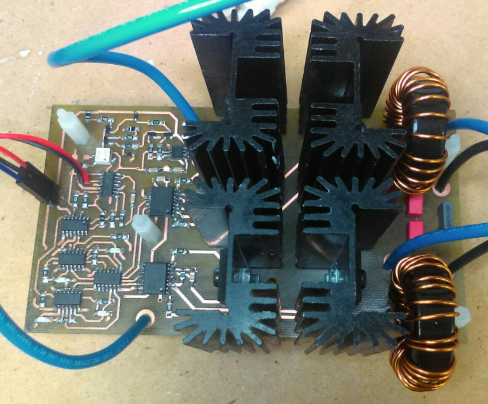

# Class-D Amplifier

 

### Abstract

In this project has been designed, simulated and built an analog class-D  power stage.
For the design, a triangular signal generator based on a TLC555 and current sources using BJT transistors has been used.
The signal is then adapted with some operational amplifiers and
logic gates. 
Drivers of the ir2010 family have been used to control the power MOSFETs.
Finally, the signal is integrated through a passive filter formed by 2 toroidal coils and some capacitors.

This is a very versatile prototype because with little changes you can get to move from a mono stage to stereo.

Furthermore the output power depends on the voltage at the power supply and is limited mainly from the heat sinks and the MOSFETs themselves, so that it can also be adapted to different needs.

Finally, it should be noted that this project does not deal with the construction of a complete audio system, this is only the power stage, and it is necessary to add a power supply, a preamplifier stage, and a kind of output formed by one or Several baffles with their corresponding Loudspeakers and passive filters.

**Important** It is necessary to use version 4.0.6 of Kicad.
